# In this simple project, I deployed a static website with AWS S3 using ClouFront as the CDN

## Here are the steps i took to achieving this

## STEP 1: Configuring the S3 bucket

I logged into my AWS account as the root user.

I created an s3 bucket and uploaded my static website files
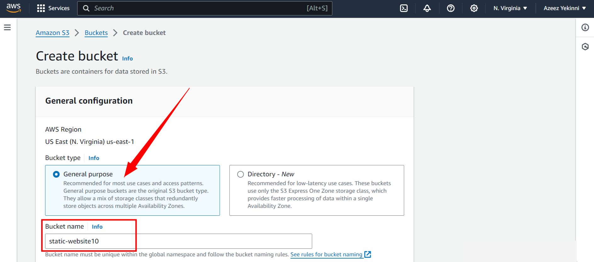

## I checked this to keep my S3 bucket private
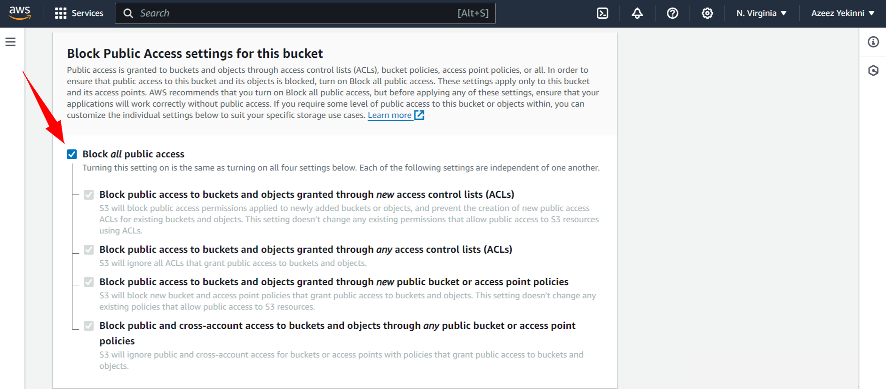

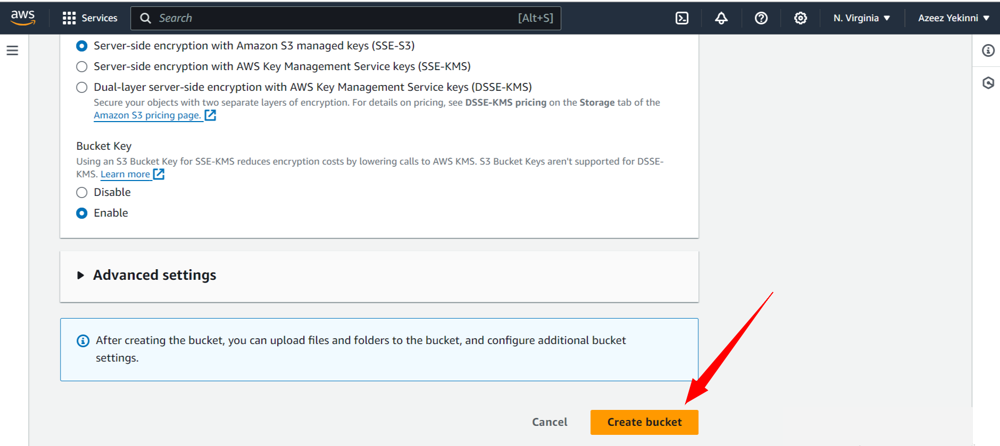
## After creating my bucket, i started uploading my website files
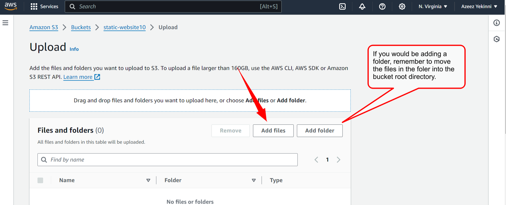

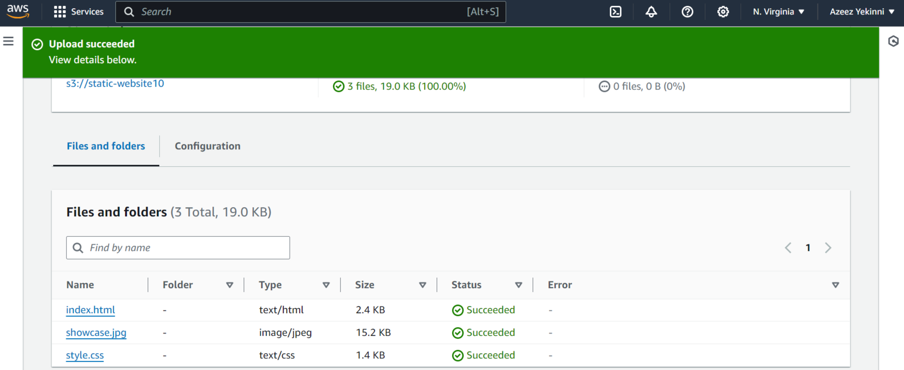

## STEP 2: Configuring the CloudFront Distribution

## I created and configured a CloudFront distribution using the static S3 end-point URL
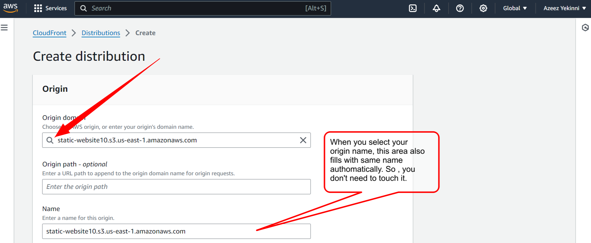

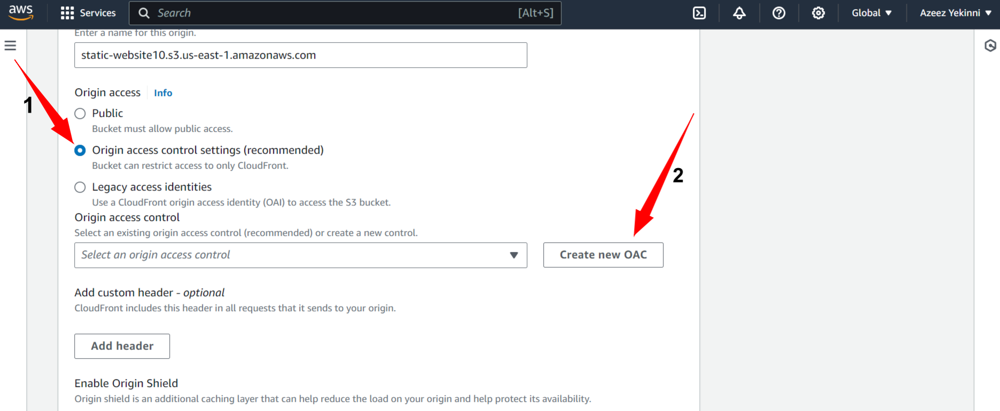

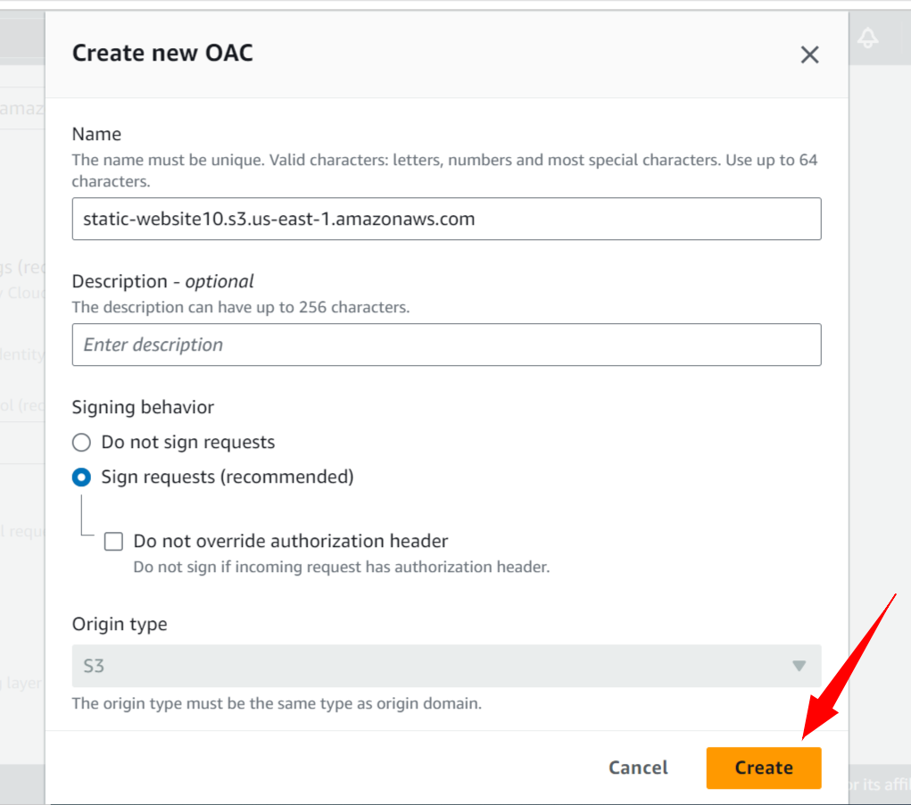

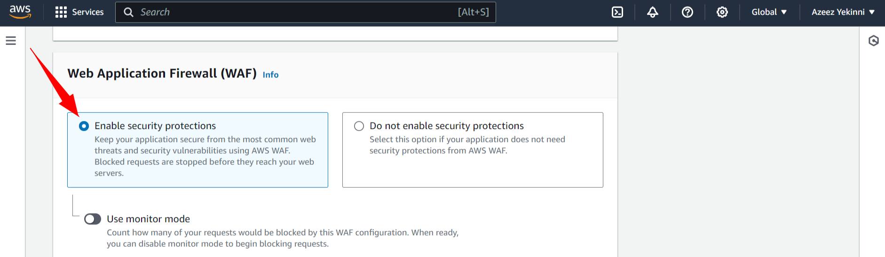

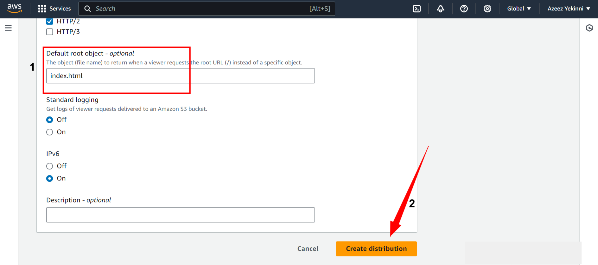

## The distribution was created and a policy was generated

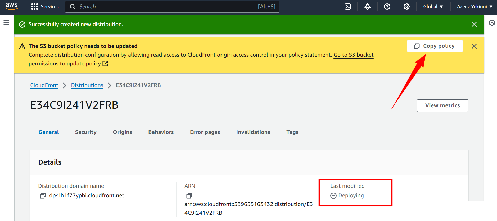

## Adding the policy generated to my S3 bucket permissions
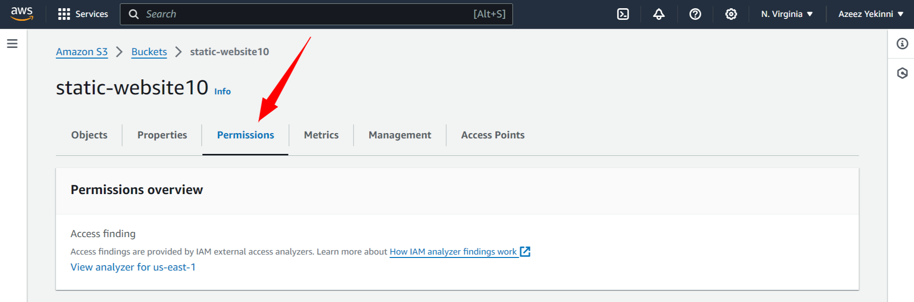

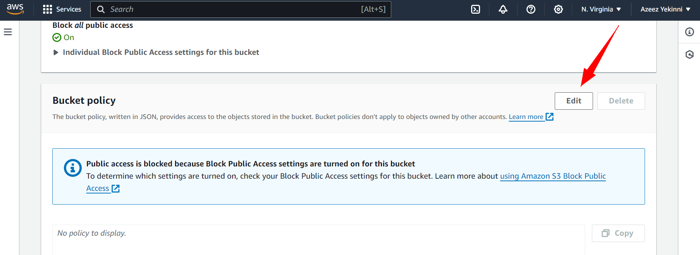

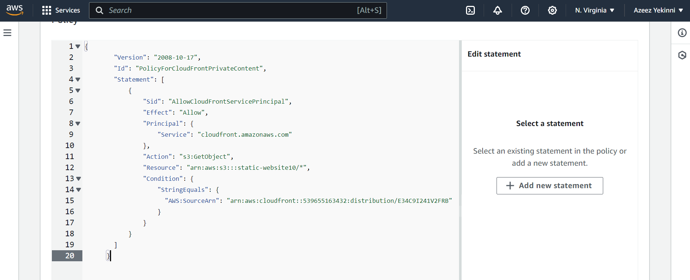

## Save Changes

## The distribution is now enabled. So, i can now copy the distribution domain name to access the website throughmy browser 

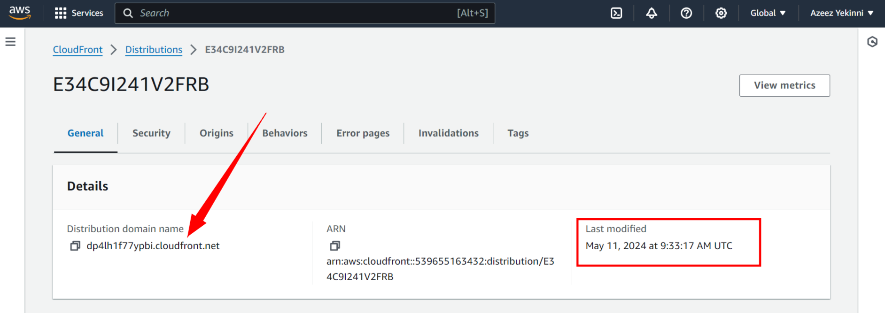

## Website successfully rendered
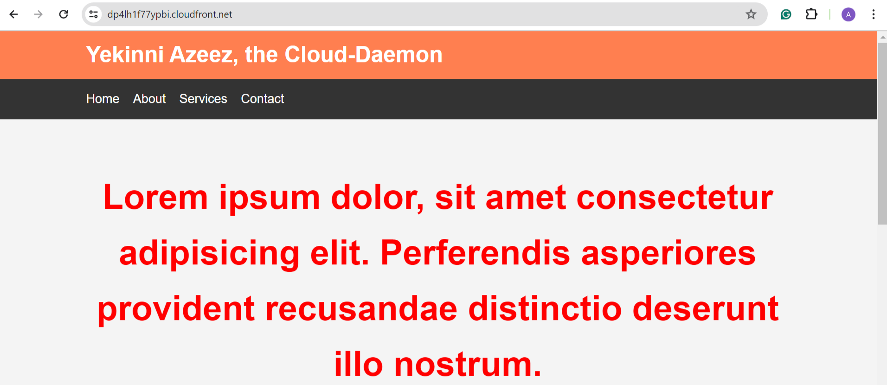

> # THANK YOU
> *yekinni azeez, the Cloud-Daemon*